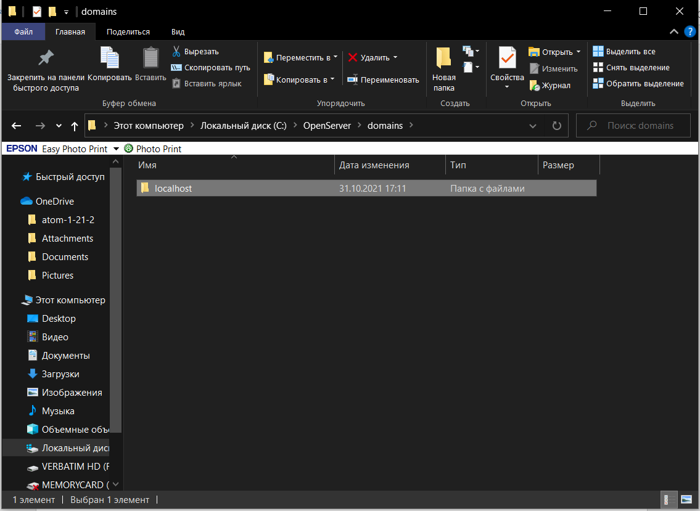
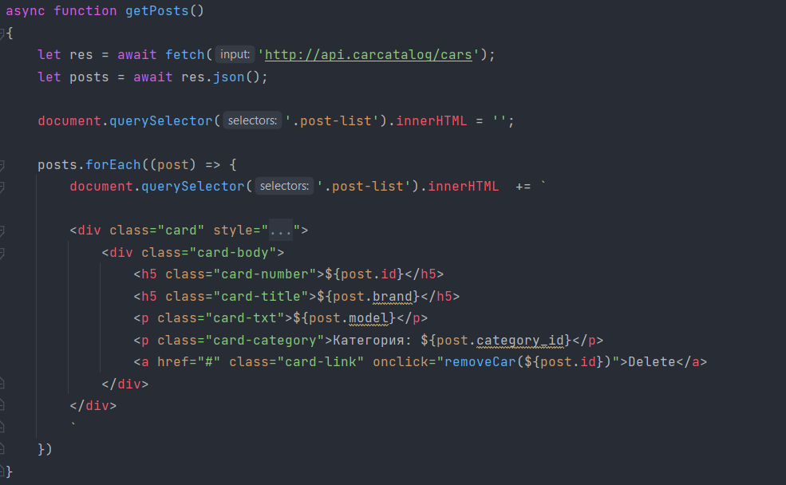

# api.carcatalog

# Как поднять сервис
+ [Пункт 1](https://github.com/The-Sanchas/api.carcatalog/new/master?readme=1#%D0%BF%D1%83%D0%BD%D0%BA%D1%82-1)

+ [Пункт 2](https://github.com/The-Sanchas/api.carcatalog/new/master?readme=1#%D0%BF%D1%83%D0%BD%D0%BA%D1%82-2)

+ [Пункт 3](https://github.com/The-Sanchas/api.carcatalog/new/master?readme=1#%D0%BF%D1%83%D0%BD%D0%BA%D1%82-3)

+ [Пункт 4](https://github.com/The-Sanchas/api.carcatalog/new/master?readme=1#%D0%BF%D1%83%D0%BD%D0%BA%D1%82-4)

+ [Пункт 5](https://github.com/The-Sanchas/api.carcatalog/new/master?readme=1#%D0%BF%D1%83%D0%BD%D0%BA%D1%82-5)

## Пункт 1

+  _Заходим в папку OpenServer_

+ _Переходим в  domains_

+ _Дальше localhost_

+ _И создаем папку api.carcatalog_

+ _После этого все скаченные  файлы мы помещаем в эту папку_

## Пункт 2

+ _Запускаем OpenServer_

+ _Переходим во вкладку настройки => домены и выбираем ручное управление_

+ _Нажимаем троеточие, находим ранее созданную нами папку и нажимаем добавить_

## Пункт 3

+ _Теперь нам нужно создать нашу базу данных. Для этого переходим в PhpMyadmin_

+ _Нажимаем создать базу и в названии пишем “ carcatalog “ ставим кодировку “utf8_general_ci”_

+ _После этого переходим в нее и нажимаем “ импорт “ => “ выбрать файл “_

+ _И дальше в нашей папку api.carcatalog находим файл  “ caracatalog.sql “  нажимаем_

+ _“открыть” => “ вперед “_

## Пункт 4
   [Вот ссылка па постменколлекцию]: https://go.postman.co/workspace/My-Workspace~97f550e7-ffb6-4819-8440-5b6da7a4474e/collection/18081926-652fd21f-de3d-4c1d-a834-062c9c6b1f3f

+ _Теперь можем работать с Postman используя этот адрес http://api.carcatalog/cars_
+ _[Вот ссылка па постменколлекцию]_ 

## Пункт 5

+ _Теперь можем использовать эту ссылку для работы с api например в функциях js_

